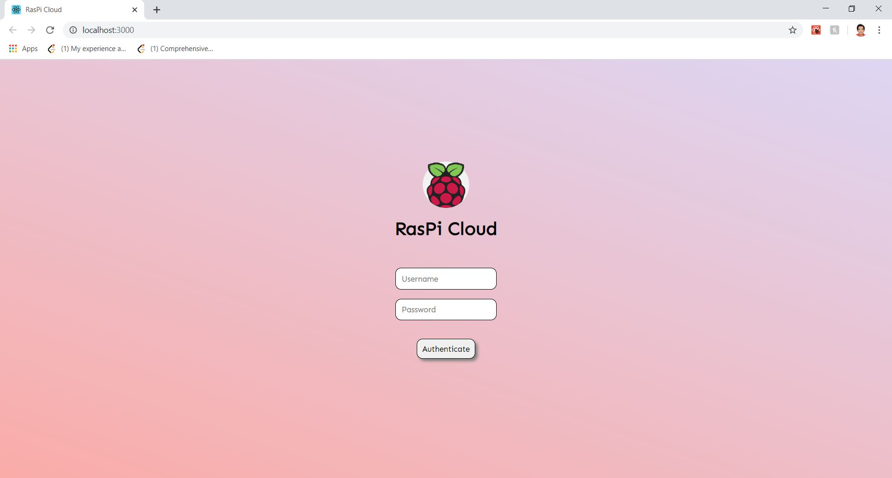
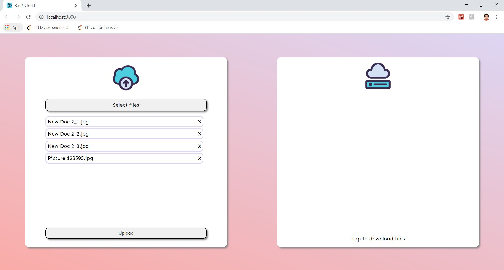
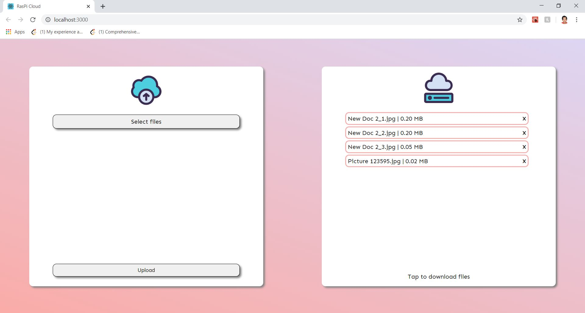

# RasPi-Cloud

## Description 

A FTP server built using **React on the front end and NodeJS on the back end using Multer and the JavaScript FileAPI** to upload and download files. The project one completed, will be **deployed on a Raspberry Pi 3** for a simple file storage functionality.

